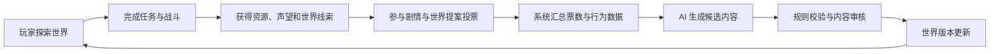
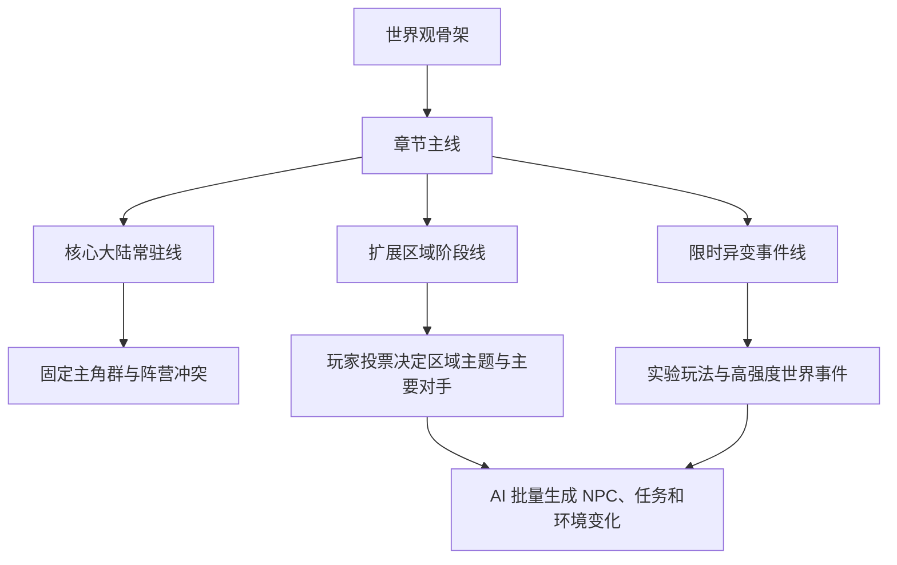
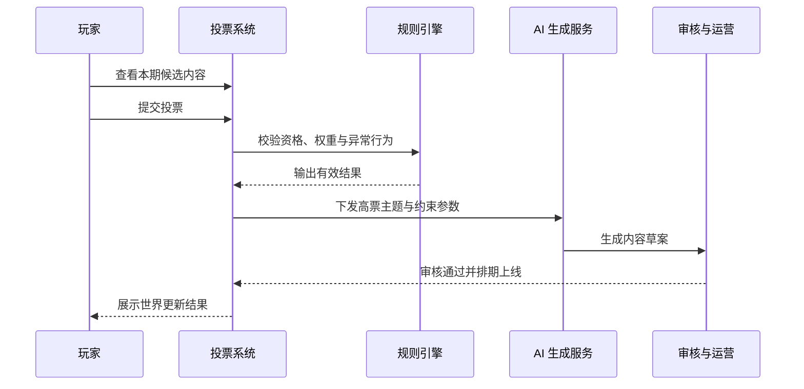

# 大型开放式 AI 生成游戏需求梳理

> 文档定位：本文件用于保留需求背景、方案讨论与立项上下文。若本文件与 `docs/20-specs/` 下的执行规范冲突，以 `docs/20-specs/` 为准。

这份文档把当前需求从概念描述整理成可继续细化的产品方案，重点回答三个问题：开放世界如何持续扩展，剧情和地图如何保持连贯，AI 全量生成内容如何在用户投票驱动下稳定落地。

`开放世界` `AI 生成内容` `玩家投票共创` `MVP 梳理`

## 目录

1. [需求判断](#需求判断)
2. [产品定位](#产品定位)
3. [核心玩法循环](#核心玩法循环)
4. [无限地图与剧情](#无限地图与剧情)
5. [AI 生成系统](#ai-生成系统)
6. [用户投票机制](#用户投票机制)
7. [功能模块](#功能模块)
8. [MVP 与验收](#mvp-与验收)

## 需求判断

| 维度 | 当前判断 | 说明 |
|------|----------|------|
| 需求类型 | 0 到 1 产品 + AI 产品 | 不是既有游戏的小迭代，而是以 AI 原生内容生产为核心的新项目。 |
| 复杂度 | 重型 | 涉及世界生成、剧情生成、内容审核、投票治理、经济系统和持续运营。 |
| 主要受众 | 产品、策划、技术、算法 | 这版文档的目标是帮助跨团队统一边界，而不是直接进入实现细节。 |
| 风险等级 | 高 | 风险集中在生成质量、世界一致性、内容安全、玩法平衡和算力成本。 |

> 待确认假设  
> 以下内容先将“无线地图”按 **“无限地图 / 可持续扩展地图”** 理解。如果你的本意是“无缝地图”或“联网地图”，地图拆分方式、加载策略和服务器架构都需要调整。平台侧暂按 PC 端优先理解，商业化方案暂不展开。

项目的关键不是单纯做一个地图很大的开放世界，而是构建一个会持续生长的世界。玩家的行为和集体投票决定下一阶段生成什么内容，AI 则把这些方向快速转化为 NPC、聚落、支线、事件和环境变化。

因此，产品设计必须同时处理两层逻辑。第一层是玩家真的愿意探索、战斗、成长和社交，第二层是世界的新增内容不会因为 AI 全量生成而变得失真、重复或失控。

## 产品定位

### 一句话定义

这是一款由玩家集体决定世界走向、由 AI 持续生成世界内容的大型开放式在线游戏。

### 核心卖点

| 方向 | 定义 | 玩家感知 |
|------|------|----------|
| 世界持续生长 | 地图按区域和时间片不断扩展，不一次性做完。 | 每个周期都有新大陆、新事件或新势力出现。 |
| 剧情共创 | 主线骨架固定，分支走向和局部冲突由玩家投票决定。 | 世界命运会被多数人的选择推着前进。 |
| 内容生成自动化 | NPC、任务、场景、环境事件和局部生态由 AI 批量生成。 | 同一世界里不同区域会有明显差异，不像重复拼贴。 |
| 运营节奏可控 | 投票不是无限制许愿，而是放在规则框架内驱动生产。 | 玩家能参与世界演化，但不会把游戏投成失衡状态。 |

### 目标用户

第一类用户是喜欢开放世界、愿意沉浸探索的人，他们在意地图规模、奇遇密度和世界真实感。第二类用户是愿意参与社区治理和共创的人，他们不只消费内容，还愿意通过投票影响接下来上线的剧情方向、区域主题和世界事件。

### 非目标

这版方案不追求让玩家直接生成任意内容，也不把世界控制权完全交给投票。玩家提出方向，系统做候选方案，审核规则和世界设定做硬约束，最终再把 AI 生成结果投入世界。

## 核心玩法循环

游戏的基础体验仍然要落在“探索、战斗、成长、获取资源、影响世界”这条主循环上。投票和 AI 生成不是外挂系统，而是嵌在循环里的世界更新机制。

| 阶段 | 玩家行为 | 系统产出 |
|------|----------|----------|
| 探索 | 进入新区域、发现地标、接触势力和收集线索。 | 沉浸体验、区域热度数据、兴趣标签。 |
| 参与 | 完成任务、击败敌人、协助阵营、建设据点。 | 角色成长、阵营声望、区域状态变化。 |
| 表达 | 对下一阶段世界内容投票，选择剧情方向或区域主题。 | 投票结果、提案热度、玩家偏好聚类。 |
| 生成 | 等待世界更新后进入新内容。 | 新 NPC、新任务、新聚落、新地貌和新冲突。 |
| 回流 | 围绕新内容再次探索和成长。 | 形成长期留存和社区讨论。 |

### 世界内容生成闭环

> 如果探索本身不好玩，投票系统只会变成活动页；如果投票结果不能稳定落地，AI 生成就只是宣传概念。两者必须互相提供价值。

## 无限地图与剧情

### 地图结构

无限地图不应理解为真正无边界随机铺开，而应理解为 **按赛季、章节和区域包逐步扩展的可持续世界**。每个区域都有独立主题、生物群系、势力关系和资源层级，避免后期新增内容只是换皮。

地图建议采用三层结构。第一层是常驻核心大陆，保证新老玩家始终有共享世界；第二层是周期扩展区域，用于承接投票结果和新剧情；第三层是限时异变区域，用于实验玩法、新敌人和特殊叙事。

### 剧情结构

主线剧情需要保留不可破坏的世界观骨架，包括世界灾变原因、关键阵营关系、文明遗迹来源和最终冲突轴。玩家投票主要影响分支走向、阶段优先级、谁成为阶段核心角色，以及哪些区域获得更多叙事资源。

这样做的好处是剧情既能演化，又不会因为票数变化完全失去因果关系。系统要允许玩家决定“往哪里走”，但不能让世界每周换一套底层设定。

### 地图与剧情扩展结构

## AI 生成系统

### 生成对象

AI 生成范围包括 NPC、聚落、野外事件、支线任务、场景装饰、敌人组合、道具描述和局部叙事文本。核心战斗规则、世界观根设定、经济底层参数和高价值奖励不建议完全交给生成模型直接决定。

### 生成链路

| 阶段 | 输入 | 输出 | 约束 |
|------|------|------|------|
| 提案归纳 | 投票结果、玩家行为、区域热度、剧情上下文 | 候选生成主题 | 必须落在当前章节和区域规则内 |
| 内容生成 | 主题标签、世界规则、素材模板、难度参数 | NPC、任务、场景和事件草案 | 命名、背景、资源、敌人强度须与区域一致 |
| 规则校验 | 生成草案 | 通过项与失败项 | 检查世界观冲突、奖励越界、内容重复和安全问题 |
| 人工或半自动审核 | 通过项 | 可发布内容包 | 重点审剧情逻辑、敏感内容和玩法平衡 |
| 上线投放 | 内容包 | 地图变化、任务刷新、NPC 入驻 | 支持灰度，支持回滚 |

### 质量要求

AI 生成系统至少要满足四个维度。其一是 **一致性**，新生成内容不能和已有世界设定打架；其二是 **可玩性**，任务和事件不能只有文本变化；其三是 **稳定性**，同样输入不能频繁产出品质波动很大的内容；其四是 **可控性**，运营需要能够限制生成方向、回滚结果和临时冻结某类内容。

> 设计边界  
> “全部由 AI 自动生成”更适合解释为 **生产流程自动化**，而不是完全没有规则模板。世界观、奖励边界、稀有资源投放、剧情关键节点和内容安全词库都必须由系统规则先定死。

## 用户投票机制

### 投票目标

投票不建议直接让玩家从零输入想法，否则内容过散且难以控制。更稳妥的方式是由系统在每个周期提供有限候选，例如“新区域主题”“阵营冲突方向”“关键角色命运”“世界事件类型”“新聚落风格”，玩家在候选中表态，系统再根据票数和行为数据生成内容。

### 投票规则

| 规则项 | 建议方案 | 目的 |
|--------|----------|------|
| 投票周期 | 按周或双周结算 | 给 AI 生成和审核留出稳定生产时间。 |
| 投票资格 | 与章节进度、账号等级或活跃度绑定 | 降低刷票和外围账号影响。 |
| 票值权重 | 基础票权一致，可叠加少量世界贡献度修正 | 鼓励活跃参与，但避免重氪或高等级垄断走向。 |
| 候选数量 | 每次 3 到 5 项 | 保证选择明确，便于系统稳定生成。 |
| 防刷策略 | 设备指纹、行为异常检测、冷却期和人工复核 | 防止社区情绪被机器号或脚本操控。 |
| 兜底规则 | 票数接近时可由系统综合区域热度与剧情连贯性决策 | 避免世界被一次偶发刷票推向极端。 |

### 玩家参与投票流程

投票系统还应向玩家解释“你的投票影响了什么”。如果票数只在后台生效，玩家会很快失去参与感。每次世界更新后，需要明确展示哪些地图变化、哪些 NPC 登场、哪些阵营走向与本期投票直接相关。

## 功能模块

### 功能总览

| # | 模块 | 功能描述 |
|---|------|----------|
| 1 | 世界地图系统 | 负责区域解锁、地貌主题、地标分布、资源刷新和区域状态变化。地图不是静态资源，而是按章节和投票结果持续新增区域包，并根据阵营冲突和世界事件改写部分地貌与 NPC 分布。 |
| 2 | 剧情与任务系统 | 负责主线骨架、支线任务、随机奇遇、势力关系和章节目标。主线保持世界观一致，支线和区域事件可由 AI 基于投票与行为数据生成，再由规则引擎限制奖励、难度和叙事边界。 |
| 3 | NPC 与聚落生成系统 | 负责生成 NPC 身份、职业、语气、关系网、日常行为和所处聚落的结构特征。生成时必须引用世界标签、文化模板、区域经济和阵营关系，避免出现风格混乱的角色和据点。 |
| 4 | 玩家投票系统 | 负责收集世界走向选择，控制投票资格、票权计算、异常识别和结果公示，并把高票方向转换成可生成的结构化参数，而不是把自然语言原样丢给生成模型。 |
| 5 | 规则审核系统 | 负责校验 AI 内容是否与剧情设定冲突、是否突破奖励边界、是否出现敏感内容、是否破坏经济平衡。该系统需要支持黑白名单、敏感词过滤、重复度检测、奖励阈值限制和手动驳回。 |
| 6 | 世界更新与回滚系统 | 负责内容上线、区域热更新、版本标记和故障回滚。因为 AI 内容可能批量进入世界，必须提供区域级灰度发布、版本归档、事件回退和玩家补偿策略。 |

### 模块说明

#### 世界地图系统

玩家进入世界后默认处于核心大陆，随着章节推进和投票结果结算，地图上会出现新的边境入口、异常裂隙、海域航线或地下遗迹。每个新区域都要带着明确目标上线，例如承接新阵营、放大某类资源竞争，或推动某个章节冲突，而不是单纯扩充面积。

#### 剧情与任务系统

任务系统需要将 AI 生成的文本内容转化成真正可执行的任务结构，包括触发条件、地点、敌人配置、目标、奖励和失败处理。对于主线关键任务，应预留人工编排节点，避免核心叙事完全依赖自动生成。

#### NPC 与聚落生成系统

NPC 不应只是名字和对白自动生成，还要绑定关系网络和行为模式。系统至少要支持“阵营归属、职业、个性标签、常驻区域、对白风格、任务池、敌对关系、出现场景”这几类结构化字段，这样玩家遇到的角色才会像世界的一部分，而不是一次性聊天对象。

#### 玩家投票系统

投票入口建议与世界大厅、阵营据点和章节结算页联动。玩家需要先看到当前世界冲突，再理解候选项代表的未来变化，最后投出选择。结果页要告诉玩家，高票选项将在何时以什么形式进入世界。

#### 规则审核系统

这里是整个产品成立与否的关键。没有这层系统，AI 会持续产出不一致、不平衡甚至有风险的内容。规则审核既要覆盖文本，也要覆盖结构化配置，比如掉落稀有度、敌人强度、刷新频次和任务奖励上限。

## MVP 与验收

### MVP 范围

第一阶段不建议一上来就做真正意义上的“所有内容都由 AI 生成”。更合理的 MVP 是先验证玩家是否愿意参与共创，以及 AI 是否能在规则模板内稳定产出可玩的区域内容。

| 范围 | MVP 取舍 | 说明 |
|------|----------|------|
| 地图 | 1 个核心区域 + 1 个可扩展新区域 | 先验证“投票决定新区域走向”是否成立。 |
| 剧情 | 1 条主线骨架 + 3 条可投票分支 | 验证玩家是否真的在意世界走向。 |
| AI 生成 | 先覆盖 NPC、支线、场景事件和聚落描述 | 先避开核心数值和经济底盘。 |
| 投票 | 按周投票，单期 3 个候选主题 | 简化治理成本，缩短验证周期。 |
| 审核 | 规则引擎 + 人工复核 | 确保第一阶段内容质量可控。 |

### 验收口径

| 维度 | 验收标准 |
|------|----------|
| 内容落地 | 一次投票周期内，系统能够稳定产出并上线至少 1 个新区域内容包。 |
| 世界一致性 | 生成内容不出现明显世界观冲突，不出现错误阵营归属和奖励越界。 |
| 玩家感知 | 玩家能明确看到本期投票结果如何影响地图、NPC 或剧情。 |
| 质量控制 | 所有上线内容都经过规则校验，支持撤回和回滚。 |
| 运营可控 | 运营可以冻结某类提案、调整候选池和限制高风险生成主题。 |

### 主要风险

最大的风险不是技术不能生成，而是生成之后不好玩。开放世界内容一旦重复，玩家会很快识别出模板感；剧情一旦失真，玩家会质疑投票是否真的有意义；审核一旦跟不上，世界就会出现设定冲突和经济漏洞。

因此，项目推进顺序建议是先验证“投票驱动的区域更新”这条最小闭环，再逐步扩大 AI 生成范围。只有当这条链路稳定后，才值得继续增加地图规模、剧情深度和自动化程度。
